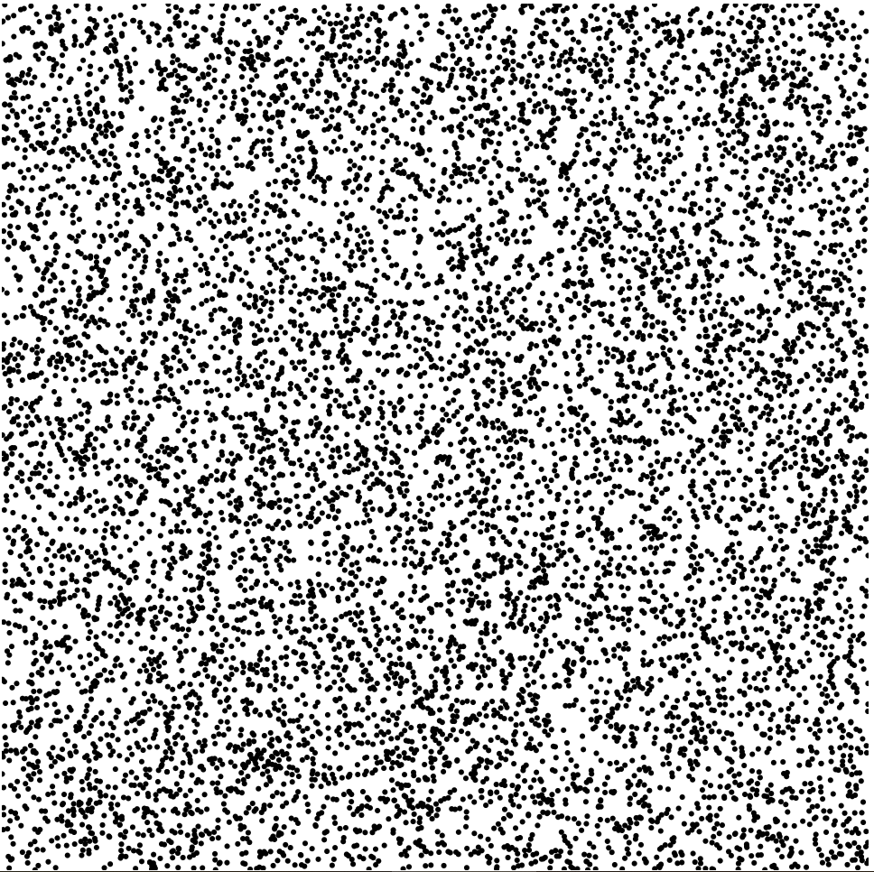
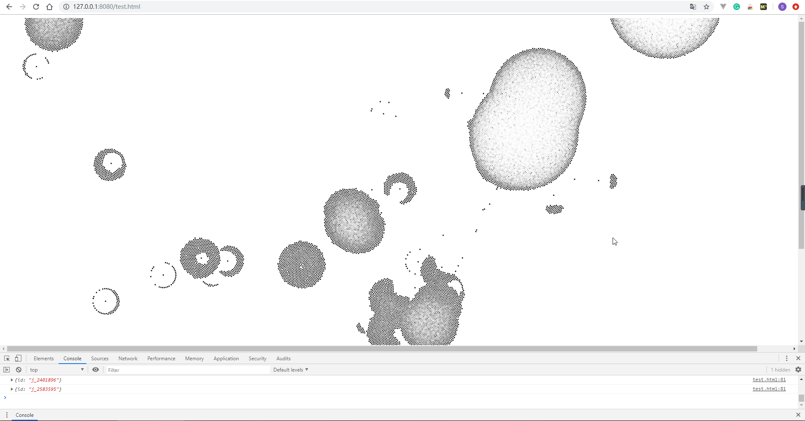

渲染DOM节点性能测试报告
===
## 基本参数
Metrics | values
|:---:|:---:|---:|
CPU|Inter(R) Core(TM) i5 @2.80GHz
RAM|16.0GB
Type|*64bit
Test Server|http-server
Browser|Chrome

## 测试对象\#1

Parameter|values
|:---:|:---:|---:|
示意图|
Layout|普通圆形节点
Number|10,000
Goal|对比canvas和svg两种画图方式的性能，哪一种比较适合画大量数据可视图
Framework|d3.js

## 测试结果
/|canvas|svg
|:---:|:---:|:---:|
Number=10,000|26ms|129ms|
Number=100,000|859ms|1270ms|
Number=1,000,000|8356ms|>46353ms(==Browser break down==)|

canvas在画大规模数据时性能是比svg好很多的（canvas是标量图，svg是矢量图）。这次的实验数据是按原数据文件大小画的，没有经过处理，所以数据量非常大。
原项目里用的是svg画图，因为目的是做一个模型，数据经过处理后变得比较常规。现在要用原数据的话就推荐用canvas。
下文就是根据canvas测试的目标视图

## 测试对象\#2

Parameter|values
|:---:|:---:|---:|
示意图|
Layout|d3-forced-Directed Treemap
Number|54,185
Goal|模拟在真实的环境中canvas的绘图性能
Framework|d3.js-forcedDirected
time|第八天的数据
data size|16.9GB
采样个数|9
采样时刻|610000、620000、……、690000

*注：在整个项目运行起来之后，总时间包括对==原数据的格式化==和==渲染视图==两部分（前一个测试没有格式化时间是因为我直接用随机数组生成的符合条件的格式数据，因为目的是对比canvas和svg所以要控制变量）*

*注2：因为主视图的目的是观察某一时刻的高负载machine在所有machine
中的占比，所以不包含slides window这种有时间跨度的思想*

*注3：图中节点都是黑色没有红色的原因是因为将节点渲染为红色和黑色所需的时间是一样的，所以为了统一，全部填充为黑色*

## 测试结果

测试了九个时间戳的数据，结果如下
Time|Node Number|
|-----------------|:---:|---:|
610000|234,114
620000|156,426
630000|203,906
640000|82,240
650000|98,995
660000|86,440
670000|99,832
680000|80,786
690000|54,185

可见，每一个时刻的节点在实际操作中的数目都是非常庞大的，对CPU的性能要求非常高

下面是canvas和svg处理以上数据时的结果：

### Treemap(via canvas)

Time|Node Number|Time to format data|Time to render DOM|
|:---:|:---:|:---:|:---:|
690000|54,185|91,076ms|95,831ms
680000|80,786|101,845ms|113,785ms
640000|82,240|121,202ms|>164,858ms(Break Down)
660000|86,440|186,752ms|Break Down
650000|98,995|233,202ms|Break Down
670000|99,832|249,202ms|Break Down
620000|156,426|Break Down|Break Down
620000|156,426|Break Down|Break Down
610000|234,114|Break Down|Break Down

Browser在构造数组和渲染都遇到了不同程度的麻烦，即使没有宕机，一分多钟的等待时间还是对于使用者来说是不可接受的。在排查问题过后，分析出了原因：
* 格式化数组的时间过长，但是这又是无法避免的。即使在优化过算法之后，性能还是没有大的提升，因为需要处理的节点数目太多，以至于格式化时占用时间较多。
* 为什么在测试一中画上万个节点就需要几毫秒，但在测试二中却处理到宕机，原因除了格式化数组占用的时间，还有就是在测试二中，d3的布局时仿照原系统组件中的布局：力导向图的形式。所以在画好第一层所有节点后，还需要上百次的迭代（给每个节点加上x方向和y方向的速度，并且还要计算一次迭代后的衰减，来模拟力的构成），所有每次迭代都要讲上万个节点重新计算dx和dy，经过大量迭代后，浏览器自然就不堪重负的崩溃了。
* svg的图像在这里就不再测试了，因为其总时长一定要比canvas的总时长多十倍以上，节点数量越多，性能差距越明显。
  
********
**总结：**
* 在运用原数据文件的前提下，很显然这种方式是行不通的，但是我目前想到的有两种解决办法：
  * **因为该视图的目的，其实就是向使用者直观的反映在每一个job cluster中，高负载的节点占总节点的占比问题。所以，我们不一定非要把所有节点都画出来，可以将原来的树状图的一簇一簇的节点集，替换成可以反映占比的可视化视图（比如饼状图），这样一来，虽然计算的压力还是不小，但是渲染的问题就迎刃而解了。（*如果想达到原来的效果，可以让使用者点击饼状图的事件，然后即可刷新出了该job下的所有节点，因为一个job顶多有上万个，然后因为只有一个job cluster，所以不需要用力布局了（不需要分离各个cluster），这样一来处理的速度就大大加快了*）**
  * **将现在读文件的形式，转化为传入数据流data stream的形式，实现动态刷新，可以缩小等待时间。**

[*View Source code*](https://github.com/shaolun-Ryan/Coding-Workstation/tree/master/Trivial_file/TestTime "点击试试")